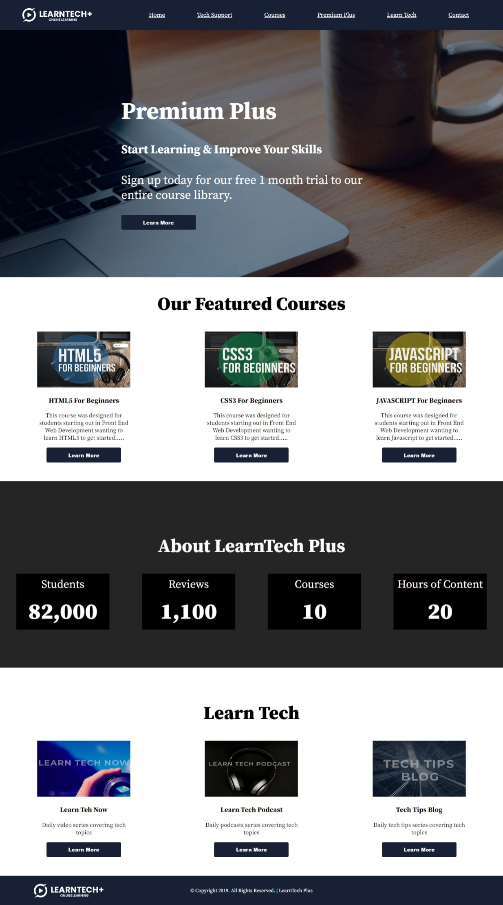

# LearnTech page

This is a sample learnTech website.

## Table of contents
- [Overview](#overview)
    - [Screenshots](#screenshots)
    - [Links](#links)
- [Process](#process)
    - [Tools used](#tools-used)
- [Author](#author)
- [Acknowledgement](#acknowledgement)

## Overview
### Screenshots

### Links
- [Github repository](#)
- [Deployed site](#)

## Process
### Tools Used
- HTML5
- CSS
- Flexbox

## Author
- Emmanuel Afrifa
- [emmaquame9@gmail.com](mailto:emmaquame9@gmail.com)
- [Twitter](https://twitter.com/Emma33712365)
- [Linkedin](https://www.linkedin.com/in/emmanuel-afrifa-840674214/)

## Acknowledgement
- Josh Werner, Learn Tecc
- [Udemy](https://www.udemy.com/course/web-development-ultimate-course/)
- [FreeCodeCamp Responsive Web Design](https://www.freecodecamp.org/learn/responsive-web-design/)